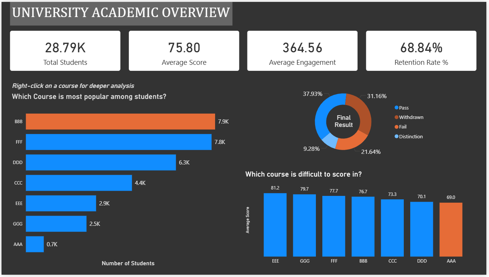
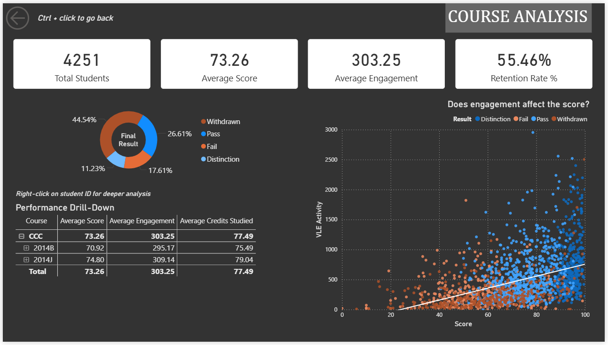
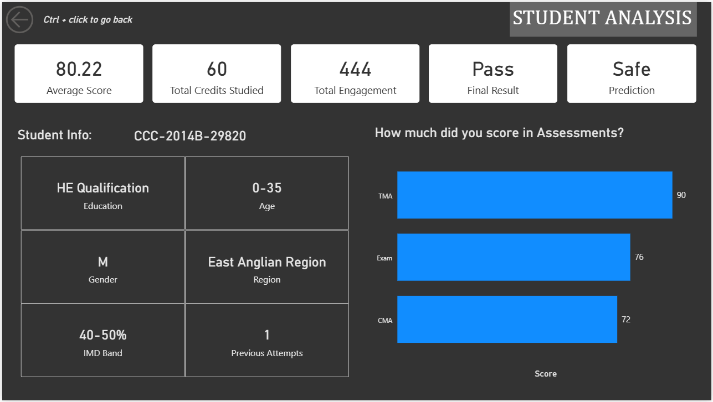
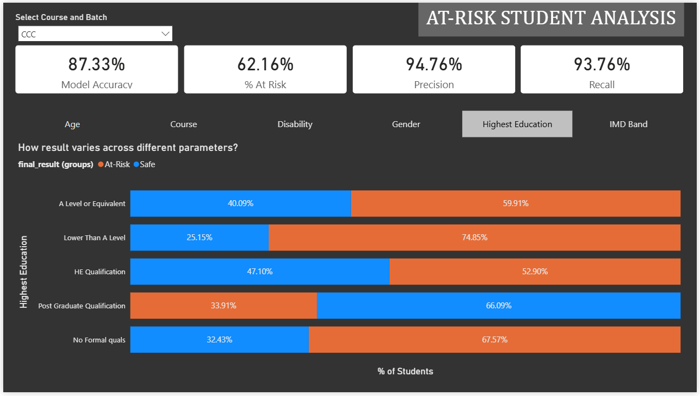

# Interactive Academic Performance Analytics Dashboard

## Project Overview

Modern higher education institutions generate vast volumes of student data, yet it often remains scattered across multiple systems, leading to reactive rather than proactive administrative decisions.

This project presents a comprehensive **data analytics and machine learning solution** designed to monitor, analyze, and improve student academic performance in a university setting.

The system integrates **data preprocessing, predictive modeling, relational database design, and interactive dashboarding** to transform raw academic data into meaningful insights. It enables stakeholders such as administrators, faculty members, and academic counsellors to identify performance trends, detect at-risk students, and make informed, data-driven decisions.

Unlike traditional reporting systems, this solution provides **real-time interactivity, predictive intelligence, and multi-level analysis**, making it a powerful tool for modern academic institutions.
</br></br>

## Objectives

- Analyze academic performance across courses, batches, and demographics
- Predict **at-risk students (Fail / Withdrawn)** using machine learning
- Provide interactive dashboards for institutional decision-making
- Enable drill-through analysis from **University → Course → Student level**
- Support early intervention strategies to improve student retention
</br></br>

## Key Features

- Interactive Power BI dashboards with dynamic filtering
- Drill-through navigation (University → Course → Student)
- Machine learning-based at-risk student prediction
- KPI monitoring (Retention Rate, Average Score, Engagement)
- Demographic-based segmentation (Age, Gender, Education, IMD Band)
- Performance correlation analysis (Engagement vs Academic Outcome)
- Dynamic model metrics (precision & recall change per course selection)
</br></br>

## Tools & Technologies Used

| Layer            | Technology                        |
| ---------------- | --------------------------------- |
| Data Processing  | Python (Pandas, Scikit-learn)     |
| Machine Learning | Logistic Regression, GridSearchCV |
| Database         | PostgreSQL, DBeaver               |
| Visualization    | Power BI                          |
| Development      | Jupyter Notebook                  |

</br>

## System Architecture

The system follows a structured layered architecture:

```
OULAD Dataset
     ↓
Data Cleaning & Pre-processing (Pandas)
     ↓
Feature Engineering & Scaling
     ↓
Logistic Regression Model
     ↓
Prediction Output (At-Risk Classification)
     ↓
PostgreSQL Database (Star Schema)
     ↓
Power BI Dashboard (Visualization Layer)
```

## ML Model: Predictive Risk Analysis

### Model Selection
**Logistic Regression** was selected due to its **high interpretability** and efficiency with structured tabular data.


### Target Variable
Binary Classification:

- 1 → At Risk (Fail / Withdrawn)
- 0 → Safe (Pass / Distinction)


### Features Used
Demographic Attributes:
- Age
- Gender
- Highest Education
- IMD Band (Socioeconomic Indicator)
- Disability

Engagement Metrics:
- Site interaction counts (VLE activity)

Academic Details:
- Course Module
- Batch
- Assessment Scores


### Optimization Techniques
- **StandardScaler:** Normalizes numerical features to ensure proportional contribution during training
- **GridSearchCV:** Hyperparameter tuning for regularization strength (C) and solver (lbfgs)
- **Class Balancing:** `class_weight='balanced'` used to handle dataset skew
</br></br>

## Performance Metrics

The model achieved an overall accuracy of **87.33%**, indicating strong reliability for institutional decision support.

| Metric    | Value  | Interpretation                 |
| --------- | ------ | ------------------------------ |
| Accuracy  | 87.33% | High overall correctness       |
| Precision | 90.74% | Minimizes false alarms         |
| Recall    | 85.09% | Captures most at-risk students |

</br></br>

## Database Design

To ensure high-speed dashboard performance, a **Star Schema** was implemented:

### Fact Table
- `student_all_details`
- Contains core academic, demographic, and engagement data

### Dimension Tables
- `student_score_details` → Assessment-level data
- `prediction_data` → ML-based at-risk classification

</br></br>

## Data Analysis & Insights

### Key KPIs

- **Retention Rate:** (Total Students - Withdrawn) / Total Students
- **Average Engagement:** Mean interaction count per student/course
- **Model Precision & Recall:** Dynamically updated per course selection


### Institution-Level Insights

The analysis highlights strong relationships between **engagement, academic performance, and student risk**:

- Higher engagement → better performance → lower risk
- Lower educational background → significantly higher risk
- Younger students (0–35) show higher risk trends
- Students with disabilities exhibit slightly elevated risk levels
- Socioeconomic factors influence performance, though moderated by course structure


### Course CCC - High-Risk Analysis

- High At-Risk Percentage (**62.16%**)
- Low Retention Rate (**55.46%**)
- Moderate engagement but insufficient for stability

Despite reasonable average scores, risk is consistently high across all demographics, indicating a **systemic issue rather than group-specific challenges**.

Students with lower educational backgrounds are especially vulnerable, suggesting the need for **stronger foundational support**.

*This makes CCC a **priority course for academic intervention**.*


### Course GGG – High Retention Outlier

- Highest Retention Rate (**88.48%**)
- Lower At-Risk Percentage (**40.25%**)
- Lowest engagement among all courses

This contradicts the general trend, suggesting:
- Efficient course structure
- Better-aligned assessments
- Reduced dependency on engagement

*GGG serves as a **benchmark for best practices in course design**.*
</br></br>

## Dashboard Overview

### 1. University Overview



- Institutional KPIs (Total Students, Avg Score, Engagement, Retention)
- Performance distribution
- Course difficulty and popularity

### 2. Course Analysis



- Course-level KPIs
- At-risk student identification
- Engagement vs performance correlation

### 3. Student Analysis



- Individual KPIs (Score, Credits, Engagement, Final Result)
- Demographic insights
- Assessment-level breakdown

### 4. At-Risk Dashboard



- Model KPIs (Accuracy, Precision, Recall, % At-Risk)
- Demographic risk segmentation
</br></br>

## Future Scope & Conclusion
- Live ERP Integration via APIs for real-time data
- Advanced AI models (Random Forest, Neural Networks)
- Automated alert system for high-risk students
- Prescriptive analytics for intervention strategies
- Role-Based Access Control (RBAC) for secure, user-specific data access
</br></br>
---
---
